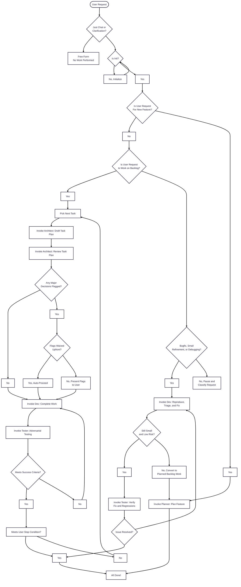

# Cursor Agentic Workflow
Rule base for AI driven development. They are a collection of hats I wear throughout my day, they encompass how I tackle planning, designing, building and testing software. The rules use subagents to flow automatically between the different roles when developing in Cursor IDE.

## Usage

Add this repository as a submodule in the root of your target project at the path `.cursor`. The files reference this path internally (e.g., `mdc:.cursor/...`).

### Add the submodule

```bash
git submodule add -b main https://github.com/Byrde/.cursor
git add .gitmodules .cursor
git commit -m "Add Cursor rules submodule"
```

If you already cloned a project that contains this submodule:

```bash
git submodule update --init --recursive
```

### Update the submodule to the latest

In any repository that uses these rules as a submodule, run:

```bash
git submodule update --remote --merge .cursor
git add .cursor
git commit -m "Update Cursor rules submodule"
```

Alternatively, inside the submodule:

```bash
cd .cursor && git fetch && git checkout main && git pull && cd -
```

Optional: Ensure `.gitmodules` tracks the desired branch (e.g., `main`) for `.cursor`.

## How It Works

The system uses an **orchestrator + subagent** architecture. The orchestrator (`rules/global.mdc`, always applied) reads your intent and project state, then delegates work to specialist subagents that each embody a distinct persona.



The orchestrator scopes the task loop to a specific task, epic, or the full backlog based on your request. `Free Form` is for chat, clarification, and lightweight discussion only; it should not be used to do work outside the prescribed process. Once the request becomes actionable, the orchestrator must route it into an explicit flow, such as planning new work that is not yet in the backlog, continuing backlog execution, or handling bugfixes, small refinements, and debugging through the rapid-fix loop.

For backlog work, it runs an architect draft pass and a separate architect review pass before development, then surfaces any major flagged decisions unless you have waived those flags up front so the workflow can continue end-to-end automatically.

For bugfixes, small refinements, and debugging, the system skips planning and architect review when the work remains small and low risk. In that rapid-fix loop, `/developer` reproduces, triages, and implements the targeted fix, then `/tester` verifies the original issue and probes for regressions. If the work grows beyond a contained fix, it gets converted into planned backlog work before continuing.

## Initialization

`@init.mdc` remains a rule for interactive one-time project setup covering initial planning, architectural design, and scaffolding. Run once per project; the orchestrator detects if init has already run and skips it.

## Subagents

| Subagent | Persona | Purpose |
|----------|---------|---------|
| `/planner` | Project Manager | Plans new work before it enters the backlog. Updates overview and populates backlog with tasks. |
| `/architect` | Architect | Drafts and reviews a specific task plan before development, then flags major decisions when needed. |
| `/developer` | Software Engineer | Implements backlog tasks and handles focused bugfix, refinement, and debugging work. |
| `/tester` | QA Professional | Adversarially verifies implemented work, reproduced fixes, and nearby regressions. |

Invoke a subagent explicitly with `/name` syntax (e.g., `/planner add user authentication`) or let the orchestrator delegate automatically based on project state.

## Structure

```
agents/
  planner.md       # Project Manager subagent
  architect.md     # Architect subagent
  developer.md     # Software Engineer subagent
  tester.md        # QA Professional subagent
rules/
  global.mdc       # Orchestrator (always applied)
  init.mdc         # One-time project setup
templates/
  overview.md      # Project overview template
  design.md        # DDD design template
  backlog.md       # Backlog table template
  testability.md   # Verification methods template
```
