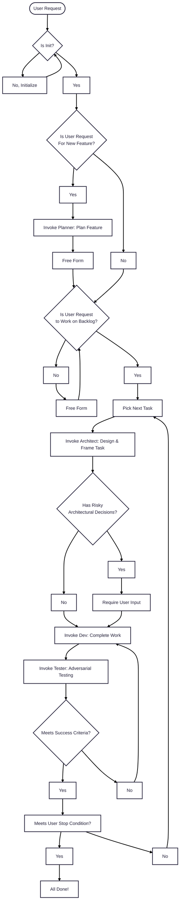

# Cursor Rules
Rule base for AI driven development. They are a collection of hats I wear throughout my day, they encompass how I tackle planning, designing, building and testing software. The rules use subagents to flow automatically between the different roles when developing in Cursor IDE.

## Usage

Add this repository as a submodule in the root of your target project at the path `.cursor`. The files reference this path internally (e.g., `mdc:.cursor/...`).

### Add the submodule

```bash
git submodule add -b main https://github.com/Byrde/.cursor
git add .gitmodules .cursor
git commit -m "Add Cursor rules submodule"
```

If you already cloned a project that contains this submodule:

```bash
git submodule update --init --recursive
```

### Update the submodule to the latest

```bash
git submodule update --remote --merge .cursor
git add .cursor
git commit -m "Update Cursor rules submodule"
```

Alternatively, inside the submodule:

```bash
cd .cursor && git fetch && git checkout main && git pull && cd -
```

Optional: Ensure `.gitmodules` tracks the desired branch (e.g., `main`) for `.cursor`.

## How It Works

The system uses an **orchestrator + subagent** architecture. The orchestrator (`rules/global.mdc`, always applied) reads your intent and project state, then delegates work to specialist subagents that each embody a distinct persona.



The orchestrator scopes the task loop to a specific task, epic, or the full backlog based on your request. It auto-proceeds through safe transitions and pauses for risky architectural decisions or destructive operations.

## Initialization

`@init.mdc` remains a rule for interactive one-time project setup covering initial planning, architectural design, and scaffolding. Run once per project; the orchestrator detects if init has already run and skips it.

## Subagents

| Subagent | Persona | Purpose |
|----------|---------|---------|
| `/planner` | Project Manager | Plan new features. Updates overview and populates backlog with tasks. |
| `/architect` | Architect | Design and frame a specific task before development. Flags risky decisions. |
| `/developer` | Software Engineer | Implement backlog tasks, write tests, update testability docs. |
| `/tester` | QA Professional | Adversarial verification of implemented work. Tries to break it. |

Invoke a subagent explicitly with `/name` syntax (e.g., `/planner add user authentication`) or let the orchestrator delegate automatically based on project state.


## Structure

```
agents/
  planner.md       # Project Manager subagent
  architect.md     # Architect subagent
  developer.md     # Software Engineer subagent
  tester.md        # QA Professional subagent
rules/
  global.mdc       # Orchestrator (always applied)
  init.mdc         # One-time project setup
templates/
  overview.md      # Project overview template
  design.md        # DDD design template
  backlog.md       # Backlog table template
  testability.md   # Verification methods template
```
